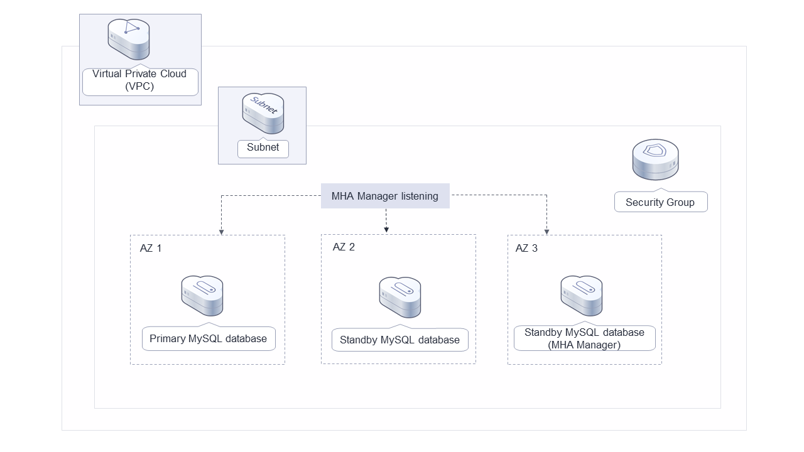
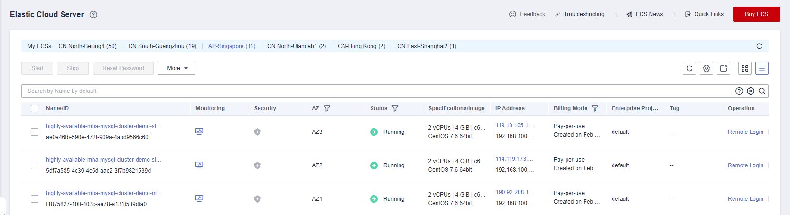
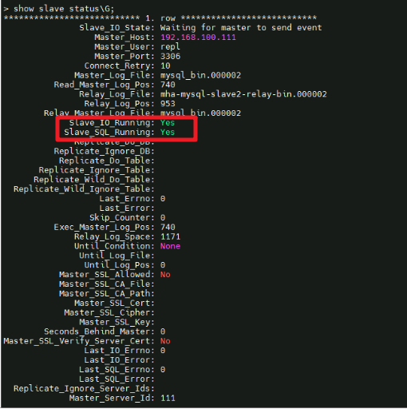
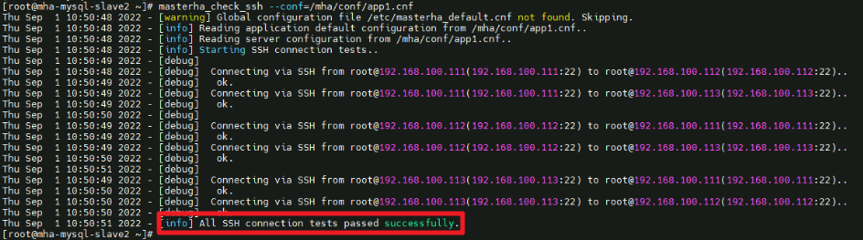
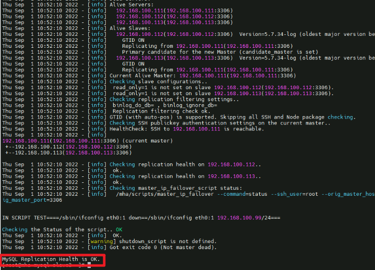
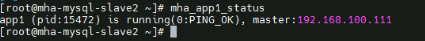
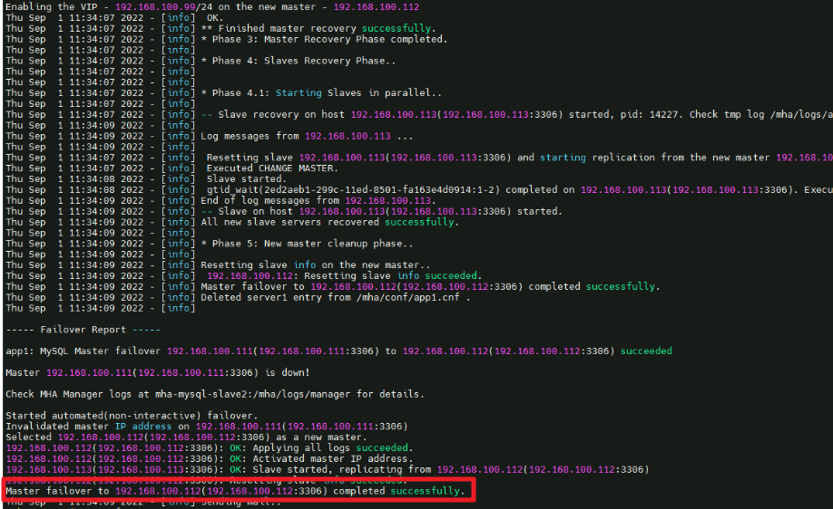
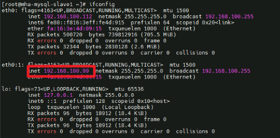
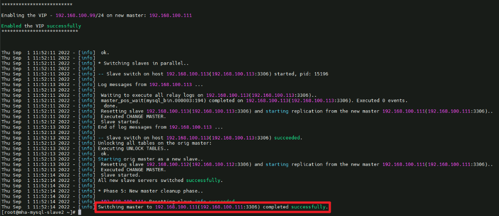

[TOC]

**Solution Overview**
===============
This solution is developed based on Master High Availability (MHA) and helps you deploy highly available MySQL clusters on Huawei Cloud ECSs. MHA is a mature and open source MySQL HA program that provides heartbeat detection, primary/standby replication, failover, and alert email sending. It is suitable for enterprises that require high availability, data integrity, and almost uninterrupted maintenance of primary servers.

For more details about this solution, visit: https://www.huaweicloud.com/intl/en-us/solution/implementations/qdmhamc.html


**Architecture**
---------------



**Architecture Description**
---------------
This solution will：

1. Create three Linux ECSs, add them to the same ECS group, set an anti-affinity policy, deploy them across AZs, and install the MHA and MySQL software on each ECS.
2. Create a virtual IP address (VIP) for primary/standby switchover of the MySQL databases.
3. Create three EIPs for deploying the MHA and MySQL software and sending alarm emails in the event of a fault.
4. Create a security group to enhance ECS security and set security group rules to specify ports that allow access to the ECSs.

**File Structure**
---------------

``` lua
huaweicloud-solution-deploy-a-highly-available-MHA-MySQL-cluster
├── deploy-a-highly-available-mha-mysql-cluster.tf.json -- Resource orchestration template
├── userdata
    ├── initialize-master.sh  -- Script configuration file for the primary database
    ├── initialize-slave1.sh  -- Script configuration file for the standby database
    ├── initialize-slave2.sh  -- Script configuration file for the standby database with MHA Manager installed
```

**Getting Started**
---------------
In this solution, three ECSs are created by default, each of which has a MySQL 5.7.34 database installed. The databases include one primary database (suffixed with **master**) and two standby databases (suffixed with **slave1** and **slave2**). By default, a user group **mysql** is created, the **mysql** administrator user is added to the user group, and the service port 3306 is enabled. You need to create account **repl** on the primary database for primary/standby replication. Set the account password to be the same as the initial ECS password. Allow only the IP addresses from 192.168.100.0/24 to access the primary database. Bind a VIP to the primary database. When a switchover is performed, the VIP is bound to the new primary database.

Install MHA Manager on the standby database (suffixed with **slave2**). An MHA program can manage multiple sets of primary and standby databases. You need to create a different configuration file for each set. In the initial solution, a configuration file for only one set of primary and standby databases is available, the default MHA administrator account is **mha**, the password is the initial ECS password, and the configuration file is stored in **/datadisk/mha/conf/app1.cnf**.

1. Log in to the [ECS console](https://console-intl.huaweicloud.com/ecm/?agencyId=WOmAijZnbElNjCFzTVDl4aJQAgdaTUMD&region=ap-southeast-1&locale=en-us#/ecs/manager/vmList), locate the three created ECSs, and click Remote Login to log in to each ECS.

	Figure 1 ECSs

	

2. Log in to the two standby databases one by one and run the following commands to check the replication statuses of the primary and standby databases:
``` lua
mysql -uroot
SHOW SLAVE STATUS\G;
```
	Figure 2 Primary/standby replication status

	

3. Log in to the ECS where MHA Manager is deployed and run the masterha_check_ssh --conf=/mha/conf/app1.cnf command to check the SSH connection statuses of the primary and standby databases.

	Figure 3 SSH connection status between the primary and standby databases

	

4. Log in to the ECS where MHA Manager is deployed and run the masterha_check_repl  --conf=/mha/conf/app1.cnf command to check the replication status of the primary and standby databases.

	Figure 4 Replication status of the primary and standby databases

	

5. On the MHA Manager, run the mha_app1_status command to check the status of MHA.

	Figure 5 MHA status

	

6. On the MHA Manager, run the tail -f /mha/logs/manager command to view log changes.

7. If there is a fault on the primary database, the MHA Manager performs a primary/standby failover and sends an alarm email. After receiving the alarm email, the user checks their primary database and rectifies the fault. After a failover is performed, the MHA Manager stops working and needs to be manually started.

	Figure 6 Failover

	

8. Check whether the VIP is bound to the new primary database (192.168.100.112).
```lua
ifconfig
```

	Figure 7 VIP binding

	

9. Restart the MySQL service on the original primary database and add it to the cluster as a standby database.
``` lua
systemctl start mysqld.service
mysql -uroot
CHANGE MASTER TO
      MASTER_HOST='192.168.100.112',
      MASTER_USER='repl',
      MASTER_PASSWORD='Password',
      MASTER_PORT=3306,
      MASTER_CONNECT_RETRY=10,
      MASTER_AUTO_POSITION=1;
START SLAVE;
SHOW SLAVE STATUS\G;
```

10. Modify the MHA Manager configuration file to add the original primary database to the cluster.
``` lua
vim /mha/conf/app1.cnf
[server1]
candidate_master=1
check_repl_delay=0
hostname=192.168.100.111
port=3306
systemctl start mysqld.service
```

11. Restart MHA on the ECS where MHA Manager is installed.
``` lua
mha_app1_start
mha_app1_status
```

12. Before performing a switchover, stop the MHA service.
```lua
mha_app1_stop
```

13. Run the following commands on MHA Manager to switch the primary and standby databases online:
```lua
masterha_master_switch --conf=/mha/conf/app1.cnf --master_state=alive --new_master_host=192.168.0.111 --orig_master_is_new_slave --running_updates_limit=10000 --interactive=0
```
If information "Switching master to 192.168.0.111(192.168.0.111:3306) completed successfully" is displayed, the switchover is successful.

	Figure 8 Manual online switchover

	

14. Check whether the VIP is bound to the new primary database (192.168.100.112).
```lua
ifconfig
```

15. Restart MHA on the ECS where MHA Manager is installed.
``` lua
mha_app1_start
mha_app1_status
```